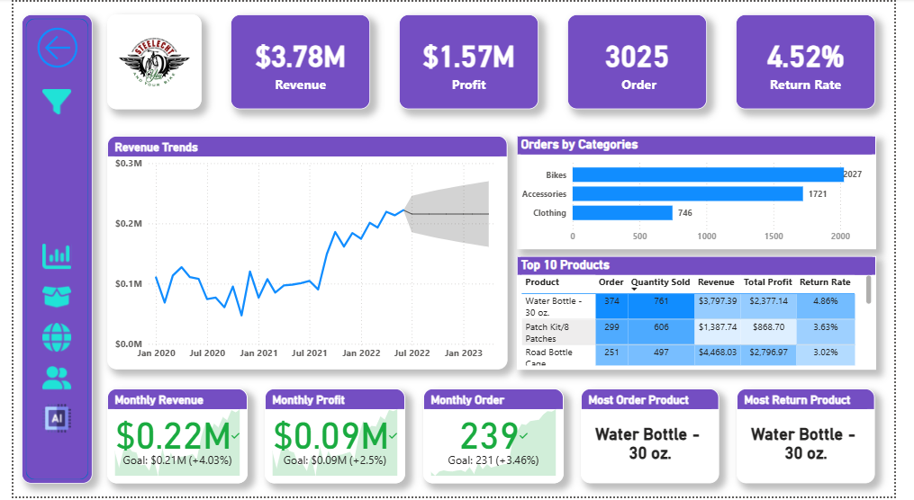
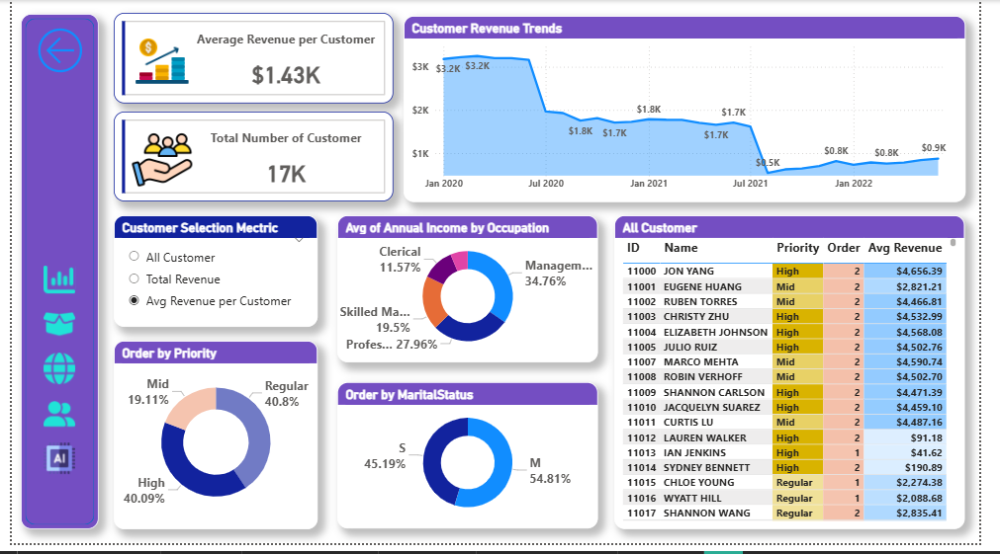
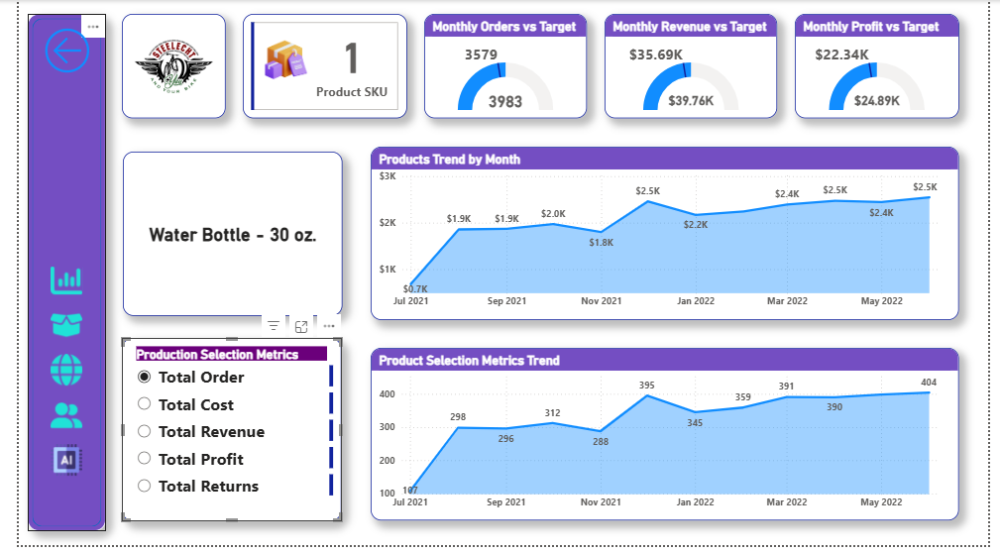

# 📊 AdventureWorks Sales Insights Dashboard | Power BI
## Interactive business intelligence dashboards built using Power BI to analyze customer insights, sales performance, and product trends.

## [Dive into the Interactive Report](https://shorturl.at/DgxFL)

---

## 📝 Overview

This repository contains 5 interactive dashboards:

- **Executive Dashboard**
- **Customer Dashboard**
- **Product Dashboard**
- **Map Visual Dashboard**
- **AI Visual Dashboard**
  
Each dashboard focuses on different aspects of business performance using clean visuals and real-time metrics.

---

## 🎯 Objective

To design insightful dashboards that help monitor key performance indicators (KPIs) and support strategic business decisions.

---

## 🛠 Tools Used

- Power BI 
- DAX (Data Analysis Expressions)  
- Power Query  
- Data Modeling & Visualization

---
### 1️⃣ Executive Dashboard

- 💰 Revenue: **$3.78M**
- 🧾 Orders: **3025**
- 💹 Profit: **$1.57M**
- 🔄 Return Rate: **4.52%**
- 📊 Top Categories: Bikes, Accessories, Clothing
- 🥇 Best Selling Product: **Water Bottle – 30 oz**
- 📆 Monthly KPIs: Revenue & profit exceeded targets

---
### 2️⃣ Customer Dashboard

- 📈 Average Revenue per Customer: **$1.43K**
- 👥 Total Customers: **17K**
- 📉 Revenue declined from $3.2K to $0.9K (2020–2022)
- 🟡 Highest revenue from "High" priority customers
- 👔 Most customers belong to the “Management” occupation group

---

### 3️⃣ Product Dashboard

- 🧴 Focus Product: **Water Bottle – 30 oz**
- 📦 Orders consistently growing (Jul 2021 – May 2022)
- 💵 Revenue increased from $0.7K to $2.5K
- 🎯 Monthly KPIs met or exceeded
- 🔁 Return Rate well-managed under **5%**

---

## 📌 Key Takeaways

- High-priority customers drive more average revenue  
- Water Bottle – 30 oz. is the most profitable product  
- Data shows seasonal trends and recovery from the revenue drop  
- Dashboards effectively track actual vs. target KPIs  
- Insightful visuals support data-driven decision-making

---

## ✅ Conclusion

These Power BI dashboards provide a comprehensive view of customer, executive, and product-level insights. They empower businesses to monitor performance, analyze patterns, and take strategic actions based on visual data storytelling.

---

## 🧑‍💻 Created by

**Nazrul Islam**  
📍 Data & Business Analyst  
📧 [nazrul.contact007@gmail.com](mailto:nazrul.contact007@gmail.com)

---

## 🌐 Let's Connect

- [LinkedIn](https://www.linkedin.com/in/nazrul-islam45)
- [Portfolio Website](https://your-portfolio-site.com)  

---

> ⭐ *If you found this project helpful or inspiring, feel free to star the repository and connect with me on LinkedIn!*

